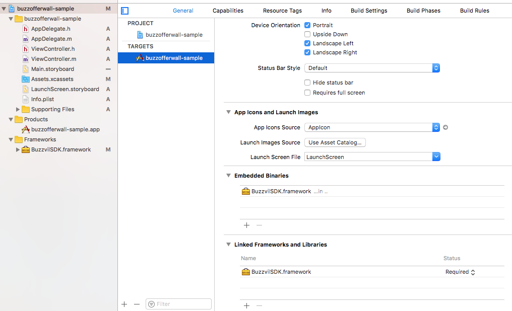

# BuzzOfferwall SDK for iOS
- 버즈오퍼월을 아이폰 어플리케이션에 연동하기 위한 라이브러리
- 아이폰 버전 지원 : iOS8 이상
- SDK 연동 및 샘플 어플리케이션 실행을 위해서는 `appKey`(버즈애드 퍼블리셔 어드민에서 확인 가능) 필요

## iOS SDK 연동가이드
### 설정
- [SDK 다운로드](https://github.com/Buzzvil/buzzad-sdk-publisher-ios/archive/master.zip) 후 압축 해제
- 압축 해제한 폴더 내의 BuzzvilSDK.framework를 개발중인 iOS 어플리케이션에 포함하고 Embedded Binaries에 추가


### 초기화
```objective-c
@interface BuzzvilCore : NSObject

+ (void)initWithAppKey:(NSString *)appKey;
+ (void)setUserId:(NSString *)userId;

@end
```
- 오퍼월을 보여주려는 ViewController의 viewDidLoad 또는 AppDelegate의 application: didFinishLaunchingWithOptions 에서 호출
- `appKey`는 퍼블리셔 어드민 페이지에 로그인하여 확인할 수 있다.
- `userId`(매체사 유저 아이디)는 포인트 적립 요청시([포인트 적립 요청 가이드](https://github.com/Buzzvil/buzzad-sdk-publisher#포인트-적립-요청포스트백---서버-연동) 참고)에 같이 전달된다. 이 값을 통해 매체사가 유저를 구분하여 포인트 지급 처리를 할 수 있다.

### 오퍼월 호출
```objective-c
@interface BuzzOfferwall : NSObject

+ (BOOL)showOfferWallWithTitle:(NSString *)title;

@end
```

### 타게팅 정보 추가(선택사항)
성별, 나이별 타게팅 정보를 가진 광고를 유저에게 보여주려 할 때 다음의 메소드를 통해 유저의 정보를 입력할 수 있다.
```objective-c
@interface BuzzvilCore : NSObject

+ (void)setGender:(NSString *)gender;
+ (void)setBirthYear:(NSInteger)birthYear;

@end
```
- `setGender` : 성별을 설정한다. 다음과 같은 미리 정의된 String을 통해 형식에 맞춰 성별을 적용해야 한다.
    - `BUZZVIL_GENDER_MALE` : 남성인 경우
    - `BUZZVIL_GENDER_FEMALE` : 여성인 경우

- `setBirthYear` : 유저의 출생 년도를 4자리의 숫자로 입력하여 나이를 설정한다.

### 사용 예제

```objective-c
#import <BuzzvilSDK/BuzzvilSDK.h>

...

- (void)viewDidLoad {
    [super viewDidLoad];
    
    [BuzzvilCore initWithAppKey:@"appKey"];
    [BuzzvilCore setUserId:@"userId"];
    [BuzzvilCore setGender:BUZZVIL_GENDER_MALE];
    [BuzzvilCore setBirthYear:1985];
}

...

- (IBAction)openButtonTouchUpInside:(id)sender {
    [BuzzOfferwall showOfferWallWithTitle:@"Get point"];
}
```

## 포인트 적립 요청(포스트백) - 서버 연동
- 버즈애드에서 포인트 적립이 발생했을 때 버즈애드에서 직접 매체사 유저들에게 포인트를 지급하는 것이 아니다. 버즈애드 서버에서 매체사 서버로 포인트 적립 요청을 보낼 뿐이고, 실제 지급은 매체사 서버에서 처리한다.
- 포인트 적립 요청을 받을 매체사 주소는 버즈애드 매체사 어드민 페이지에서 등록하면 해당 주소로 포인트 적립시에 요청이 이루어진다.

### 포인트 적립 요청 스펙
- HTTP METHOD : POST
- 요청 방향 : 버즈애드 서버 -> 매체사 서버
- 파라미터

    | Name  | Type | Description |
    | ------ | ----------| ----------- |
    | app_key  | Integer | SDK 연동시 사용한 **app_key**  |
    | campaign_id | Integer | 참여한 광고 아이디  |
    | title | String | 참여한 광고명  |
    | user_id  | String | 매체사 유저 아이디로 SDK의 BuzzAd.showOfferWall 호출시 전달했던  `userId`|
    | point | Integer | 유저에게 지급해야 할 포인트 |
    | transaction_id | String | 포인트 중복 적립을 막기 위한 **id**.<br>같은 **transaction_id**로 요청이 온 경우에는 반드시 포인트 중복 적립이 안되도록 처리해주어야 한다.<br>**최대 64자까지 전달 될 수 있으므로, 연동 시 확인이 필요하다.**|
    | event_at | Long | 포인트 지급 시점. **timestamp**값이다.<br>대부분 API 호출시점과 동일하지만 API 호출이 재시도인 경우 다를 수 있다.|
    | extra | String | 매체사별 자체 정의한 캠페인 데이터의 json serilaize된 스트링.<br>라이브중에 캠페인 extra 정보가 바뀐 경우, 실제 포인트 적립 api에서 바뀐 정보가 적용되는데에 최대 10분이 걸릴 수 있다.<br>eg) `{"sub_type": "A", "source":"external"}`|
    | is_media | Integer |0: 버즈빌측 캠페인<br>1: 매체사측 캠페인|
    | revenue_type | String | 광고 타입. cpi, cpe, cpa 등의 값이 올 수 있다. |
    | action_type | String | 포인트를 지급 받기 위해 유저가 취한 액션 타입.<br>추후 새로운 타입이 추가될 수 있으므로 연동시 이를 고려해야 한다. <ul><li><b>u</b>: 잠금해제 </li><li><b>l</b>: 랜딩</li><li><b>a</b>: 액션</li></ul>|

- 포인트 적립 요청에 매체사 서버는 정상 처리된 경우는 `HTTP STATUS 200` 응답을 보내야 하며, 그 외의 경우 특정 시간동안 포인트 적립 요청은 재시도가 된다.
    > **주의** : 만약 중복된 `transaction_id`가 포스트백을 통해 전달되면, `HTTP STATUS 200` 응답을 보내야 한다. 그렇지 않으면, 해당 요청에 대해 재시도가 이루어진다.
